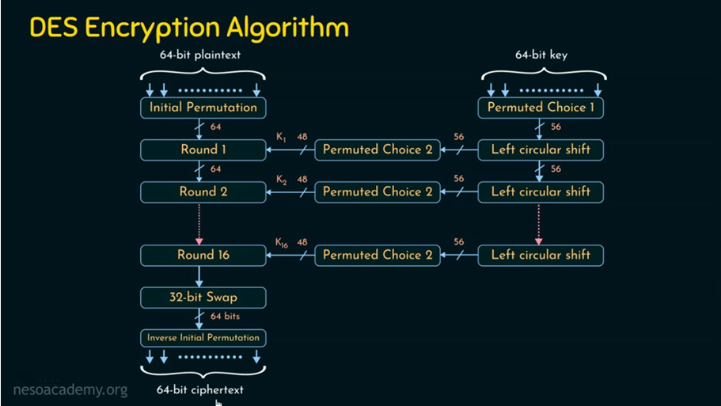
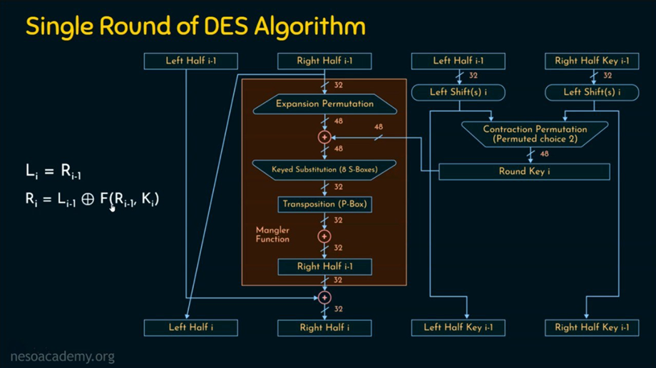
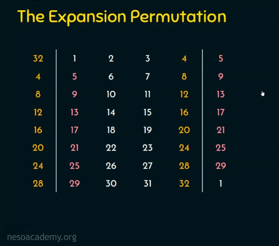
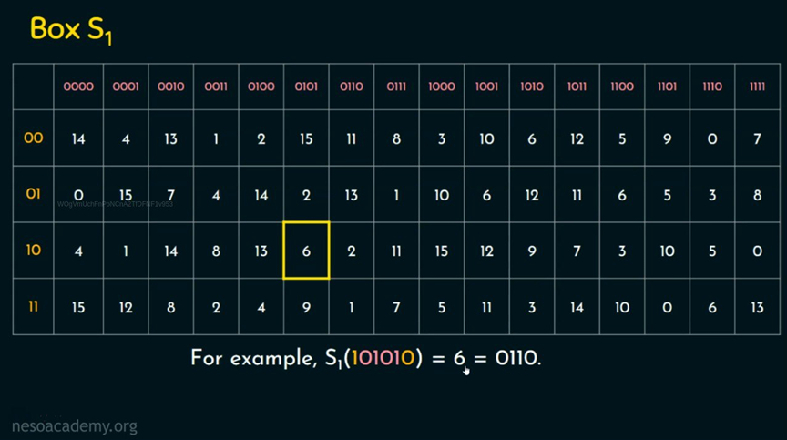
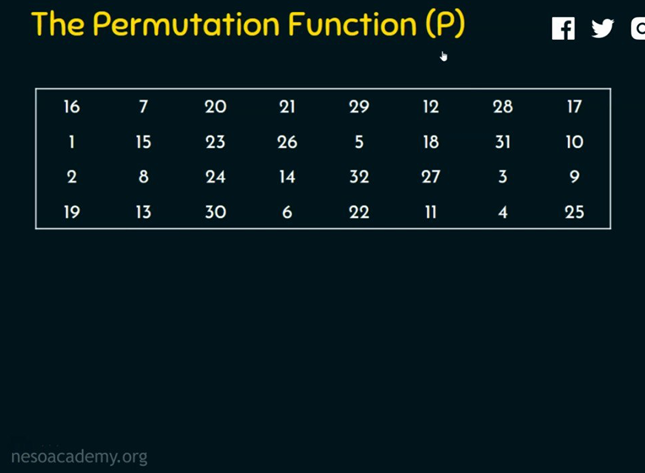
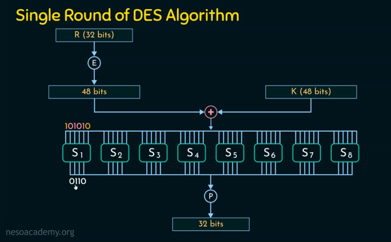
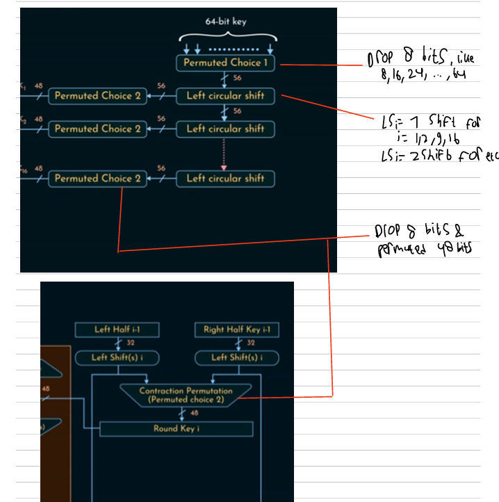

# Keamanan-Informasi-B_DES-Algorithm
## Table of Contents
1. [What is DES](#what-is-des)
2. [High Level of DES encryption process](#high-level-of-des-encryption-process)
3. [Single Round of DES algoritm](#single-round-of-des-algoritm)
4. [Key Scheduling](#key-scheduling)
5. [DES Decryption Process](#des-decryption-process)
5. [Notes](#notes)

## What is DES?

The Data Encryption Standard (DES) is a symmetric-key algorithm for the encryption of digital data. Unlike methods that encrypt data one bit at a time, DES is a block cipher, meaning it encrypts data in fixed-size blocks of 64 bits.

The core of the algorithm is a complex process that runs for 16 rounds. Each round performs a series of substitutions and permutations to transform the data. At the heart of each round is the Mangler function (also known as a Feistel function), which provides the critical step of scrambling the data in a controlled way.

To ensure each of the 16 rounds is unique, a key scheduling process generates a different 48-bit subkey for every round from the original 56-bit master key. The Mangler function uses this subkey to manipulate half of the data block, creating the confusion and diffusion that makes the cipher secure.

## High Level of DES encryption process
The DES encryption process starts with two inputs: a 64-bit block of plaintext and a 64-bit key. It's important to note that while the key is 64 bits, 8 of those bits are used for parity checking and are discarded, making the effective key size 56 bits.

Initial Permutation (IP): The first step is to subject the 64-bit plaintext block to an initial permutation. This is not a random shuffle but a fixed and public rearrangement of the bit positions, based on a predefined table known as the IP table. This process rearranges the bits into a new 64-bit sequence.

Splitting the Block: After the initial permutation, the 64-bit block is split into two equal halves: a 32-bit left block (L₀) and a 32-bit right block (R₀).

These two blocks, L₀ and R₀, form the input for the first of the 16 rounds that make up the core of the DES algorithm.

## Single Round of DES algoritm

The core of DES is its 16 identical rounds of processing. The input to each round i (from 1 to 16) consists of the left and right blocks from the previous round (Lᵢ₋₁, Rᵢ₋₁) and a unique 48-bit round key (Kᵢ).

The logic for a single round follows the Feistel network structure:

The new left block is the previous right block: Lᵢ = Rᵢ₋₁

The new right block is the previous left block XORed with the output of the Mangler function: Rᵢ = Lᵢ₋₁ ⊕ f(Rᵢ₋₁, Kᵢ)

This means that in each round, the right block and the round key are passed into the Mangler function, and the output is then combined with the left block.

### Inside the Mangler Function 
The Mangler function is where the main cryptographic work happens. It involves four key steps:

1. Expansion Permutation (E-box): The 32-bit right block (Rᵢ₋₁) is expanded to 48 bits. This is achieved by duplicating certain bits and rearranging them according to a fixed table. This expansion is necessary so the data block size matches the 48-bit round key.

2. Key Mixing (XOR): The expanded 48-bit block is XORed with the 48-bit round key (Kᵢ). This critical step mixes the key's information with the data.

3. Substitution (S-boxes): The resulting 48-bit block is divided into eight 6-bit chunks. Each chunk is fed into a specific Substitution Box (S-box). Each S-box is a non-linear lookup table that takes a 6-bit input and produces a 4-bit output. This substitution step provides the crucial "confusion" that makes the relationship between the key and the ciphertext difficult to determine.

4. Permutation (P-box): The eight 4-bit outputs from the S-boxes are recombined into a 32-bit block. This block is then put through a final permutation (the P-box), which shuffles the bits to spread the influence of the S-box outputs across the entire block (a property called "diffusion").

The 32-bit output of the P-box is the final result of the Mangler function for that round.

## Final Steps After 16 Rounds
After all 16 rounds are completed, two final steps are performed:

1. Final Swap: The left (L₁₆) and right (R₁₆) blocks are swapped one last time. (Note: This is a reversal of the swap that occurs at the end of every other round).

2. Final Permutation (IP⁻¹): The swapped blocks are recombined into a 64-bit block. This block is then subjected to the Final Permutation, which is the exact inverse of the Initial Permutation performed at the very beginning.

The result of this final permutation is the 64-bit block of ciphertext.

## Key Scheduling

A critical component of the DES algorithm is its key scheduling process. This procedure takes the initial 64-bit key and generates 16 unique 48-bit subkeys, one for each round of encryption. This ensures that the data is transformed differently in every round.

The process can be broken down into three main stages:

1. Initial Key Permutation (Permuted Choice 1 - PC-1): The process begins with the 64-bit key. First, every eighth bit (bits 8, 16, 24, etc.) is discarded. These are parity bits and are not used in the encryption process, reducing the key to 56 bits. This 56-bit key is then subjected to a permutation called PC-1, which shuffles the bits into a new order.

2. Splitting and Shifting: After the PC-1 permutation, the 56-bit key is split into two 28-bit halves, C₀ and D₀. For each of the 16 rounds, both halves are treated separately and are rotated to the left (circularly shifted) by either one or two bit positions. The number of shifts per round is determined by a fixed schedule:

    - Rounds 1, 2, 9, and 16: Shift by one bit.

    - All other rounds: Shift by two bits.

    This shifting ensures that a different set of bits is used to generate each round key. After each shift, we get new halves, Cᵢ and Dᵢ.

3. Compression Permutation (Permuted Choice 2 - PC-2): For each round i, the shifted halves (Cᵢ and Dᵢ) are combined back into a 56-bit block. This block is then passed through a compression permutation, PC-2. This permutation selects 48 of the 56 bits and shuffles them, producing the final 48-bit round key, Kᵢ.

This entire process, from shifting to the PC-2 compression, is repeated 16 times to generate the 16 unique round keys needed for the encryption.

## DES Decryption Process

A remarkable feature of the Feistel network, which forms the foundation of DES, is that the decryption process is almost identical to the encryption process. The same algorithm is used for both, with only one crucial difference.

The overall structure of decryption mirrors encryption:

1. The 64-bit ciphertext block goes through the Initial Permutation (IP).

2. The block is split into a 32-bit left half and a 32-bit right half.

3. The data proceeds through the same 16 rounds of processing as in encryption.

After the 16th round, the halves are swapped, recombined, and then subjected to the Final Permutation (IP⁻¹) to produce the original plaintext.

The Key Difference: A Reversed Schedule
The only change is the order in which the 48-bit round keys are applied. For decryption, the key schedule is used in reverse:

In Round 1 of decryption, round key K₁₆ is used.

In Round 2 of decryption, round key K₁₅ is used.

...and so on, until Round 16, where round key K₁ is used.

This reversal is what makes the process work. Because the core operation in the Feistel structure is an XOR, applying the same process with the keys in reverse effectively "undoes" each round of encryption, restoring the original plaintext.

## Notes
All images in here are from [nesoacademy](https://www.nesoacademy.org/cs/11-cryptography-and-network-security/03-block-cipher/03-introduction-to-data-encryption-standard-des)